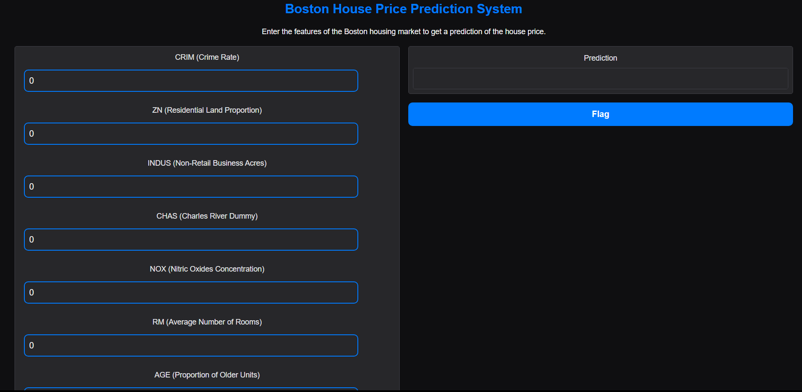

# House-Price-Prediction

A machine learning project that predicts house prices based on various features of the Boston Housing Dataset. This project demonstrates training a regression model and building a user-friendly web interface using Gradio.

---

## 📁 Project Structure


---

## 🧠 Tech Stack

- **Language:** Python  
- **ML Library:** Scikit-learn  
- **Interface:** Gradio  
- **Other Tools:** NumPy, Pandas, Matplotlib

---

## 🚀 How it Works

### 1. Model Training
The `train_model.ipynb` notebook loads the Boston Housing dataset, performs preprocessing, trains a regression model, and saves it as `model.pkl`.

### 2. User Interface
The `app.ipynb` notebook uses Gradio to create a clean web interface. You can input various house features like:
- Crime Rate
- Number of Rooms
- Property Tax Rate
- Distance to Employment Centers, etc.

The model predicts the house price based on the entered features.

---

## 🖼 Screenshot



---

## 🛠 How to Run

1. **Clone the Repository**
   ```bash
   git clone https://github.com/bhavesh-exe/house-price-prediction.git
